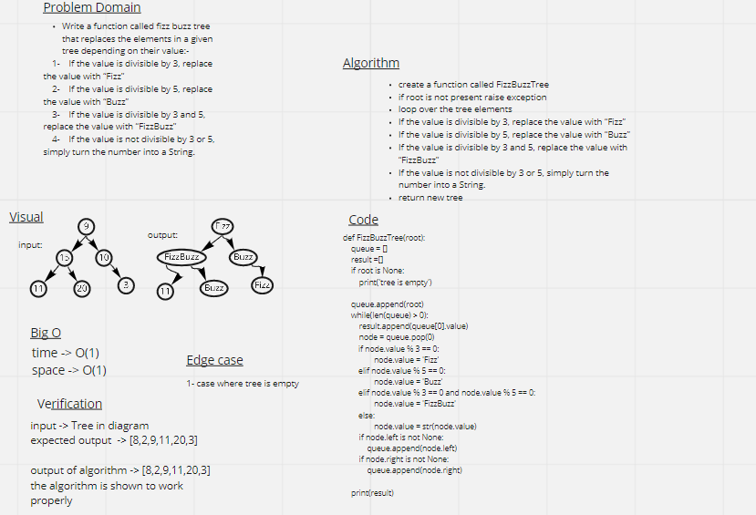

# Challenge Summary
Write a function called fizz buzz tree that replaces the elements in a given tree depending on their value:-
 1- If the value is divisible by 3, replace the value with “Fizz”
 2- If the value is divisible by 5, replace the value with “Buzz”
 3- If the value is divisible by 3 and 5, replace the value with “FizzBuzz”
 4- If the value is not divisible by 3 or 5, simply turn the number into a String.

## Whiteboard Process

## Solution
root = Node(9)
root.left = Node(15)
root.right = Node(10)
root.left.left = Node(11)
root.left.right = Node(20)
root.right.right = Node(3)

TreeBreadthFirst(root)

OUTPUT: ['Fizz', 'Fizz', 'Buzz', '11', 'Buzz', 'Fizz']
