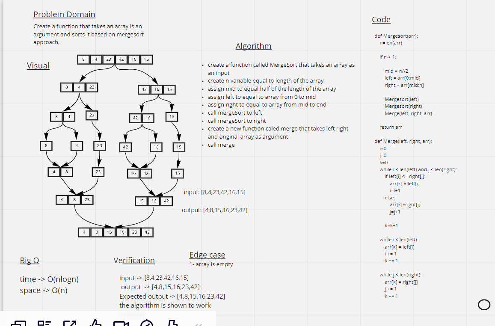

# Challenge Summary
    merge sort (also commonly spelled as mergesort) is an efficient, general-purpose, and comparison-based sorting algorithm. Most implementations produce a stable sort, which means that the order of equal elements is the same in the input and output.

## Whiteboard Process

## Approach & Efficiency
    Time--> O(nlog(n))
    space--> O(n)

## Solution

arr = [8,4,23,42,16,15]
InsertionSort(arr)

Expected output = [4,8,15,16,23,42]
Output: [4,8,15,16,23,42]

