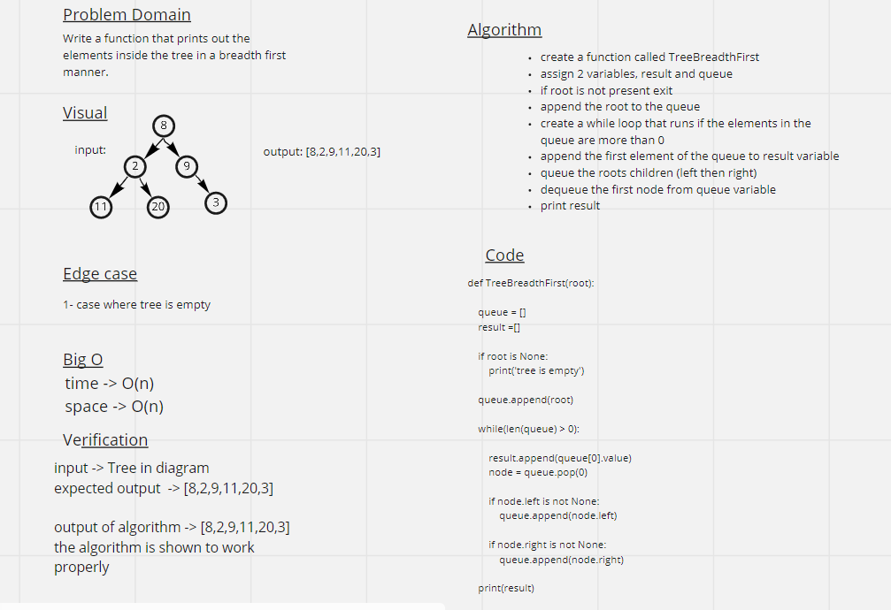

# Challenge Summary
Write a function that prints out the elements inside the tree in a breadth first manner.

## Whiteboard Process

## Solution
root = Node(8)
root.left = Node(2)
root.right = Node(9)
root.left.left = Node(11)
root.left.right = Node(20)
root.right.right = Node(3)

TreeBreadthFirst(root)

OUTPUT: [8, 2, 9, 11, 20, 3]
