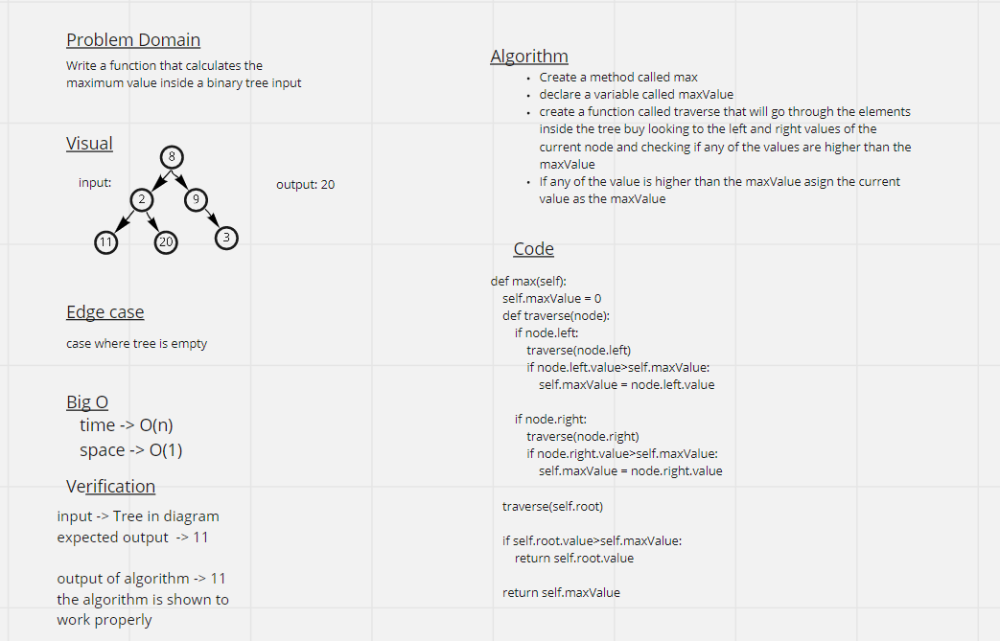

# Challenge Summary
Calculate the maximum value of a given binary tree

## Whiteboard Process

## Approach & Efficiency
<!-- What approach did you take? Why? What is the Big O space/time for this approach? -->

## Solution
    input = tree in the pic
    Expected output = 11

    self.max=0
    traverse(Node(2))

    if Node(7): True
    traverse(Node(7))
    ...
    if Node(5): True
    traverse(Node(5))
    ...

    if 2>11 #False

    return 11
