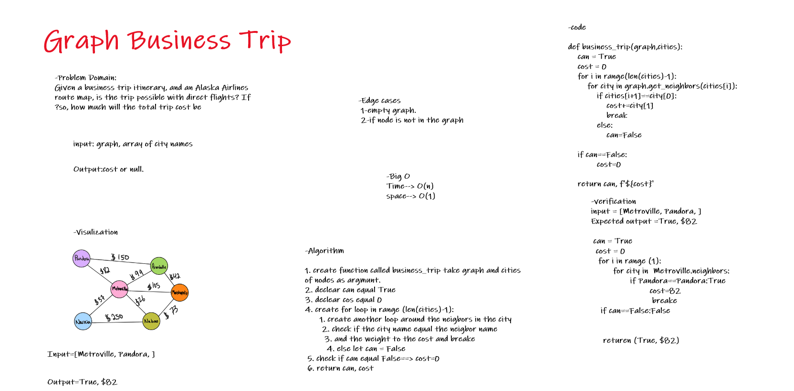

# Graph Business Trip

Given a business trip itinerary, and an Alaska Airlines route map, is the trip possible with direct flights? If so, how much will the total trip cost be.

# Challenge Summary

Write a function called business trip

Arguments: graph, array of city names

Return: cost or null

## Whiteboard Process

## Approach & Efficiency

* Time--> O(n)
* space--> O(1)
