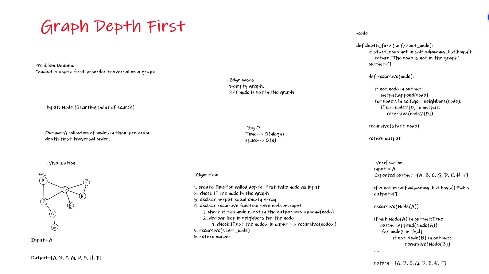

# Graph Depth First

Conduct a depth first preorder traversal on a graph.

# Challenge Summary

Write the following method for the Graph class:

* depth first
* Arguments: Node (Starting point of search)
* Return: A collection of nodes in their pre-order depth-first traversal order
* Display the collection

## Whiteboard Process

## Approach & Efficiency

* Time--> O(nlog(n))
* space--> O(n)
