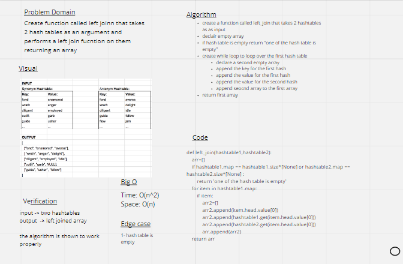

# Hashmap LEFT JOIN
Create function called left joinn that takes 2 hash tables as an argument and performs a left join fucntion on them returning an array

## Whiteboard

## Approach & Efficiency
Space: O(n)
Time: O(n^2)

