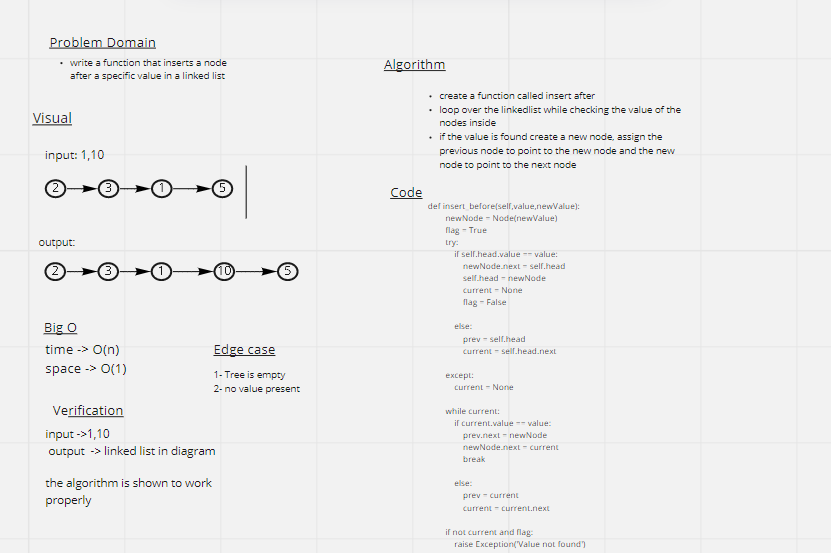
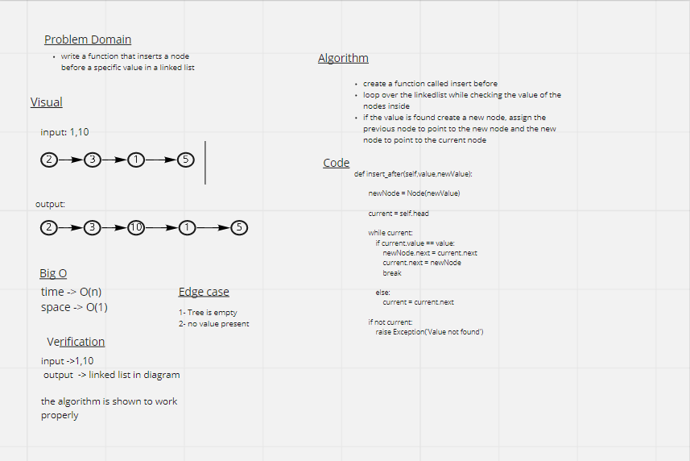

# Challenge Summary
    Append: write a function that adds a new node to the end of the linked list
    Insert after: write a function that inserts a node after a specific value in a linked list
    Insert Before: write a function that inserts a node before a specific value in a linked list

## Whiteboard Process

## Approach & Efficiency
    for all the challenges the bigO of time is O(n) and the big) of space is O(1)

## Solution

    Append:
        ll = LinkedList()
        ll.head = Node(1)
        ll.head.next = Node(2)
        ll.head.next.next= Node(3)
        ll.append(10)
        print(ll.head.next.next.next.value)

    output: 10

    Insert After
        ll = LinkedList()
        ll.head = Node(1)
        ll.head.next = Node(2)
        ll.head.next.next= Node(3)
        ll.insert_after(1,10)
        print(ll.head.next.value)

    output: 10

    Insert before
        ll = LinkedList()
        ll.head = Node(1)
        ll.head.next = Node(2)
        ll.head.next.next= Node(3)
        ll.insert_before(2,10)
        print(ll.head.next.value)

    output: 10
