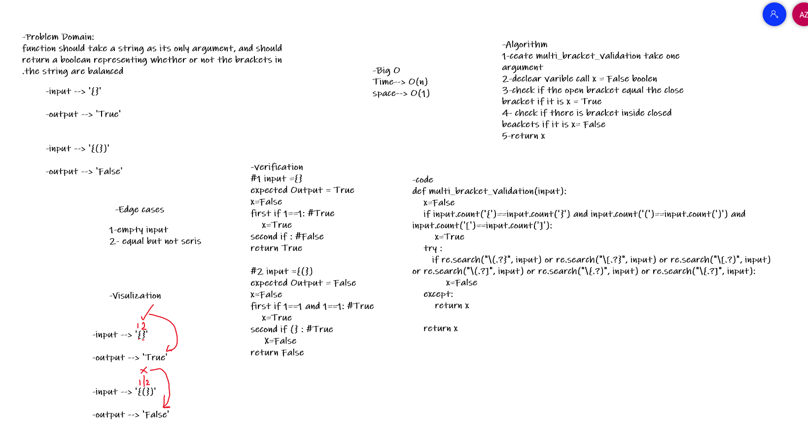

# Challenge Summary
function should take a string as its only argument, and should return a boolean representing whether or not the brackets in the string are balanced.

## Whiteboard Process

## Approach & Efficiency

Ceate multi_bracket_validation take one argument, declear varible call x = False boolen, check if the open bracket equal the close bracket if it is x = True, check if there is bracket inside closed beackets if it is x= False, return x.

Big O :
* time : O(1)
* space : O(1)
