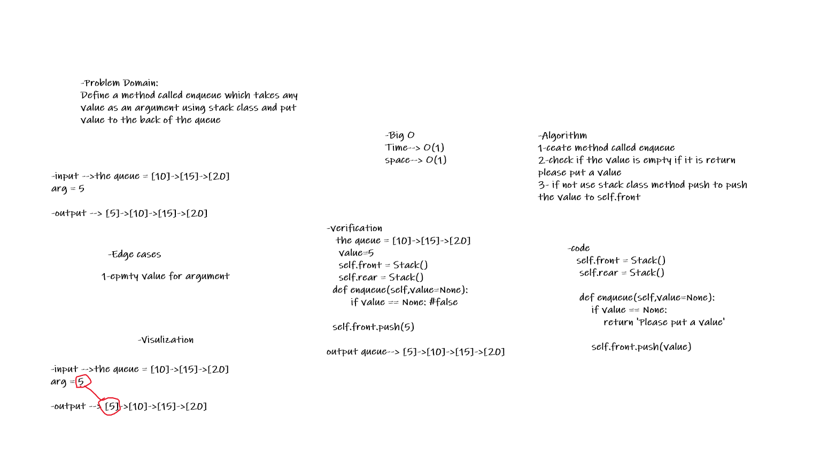
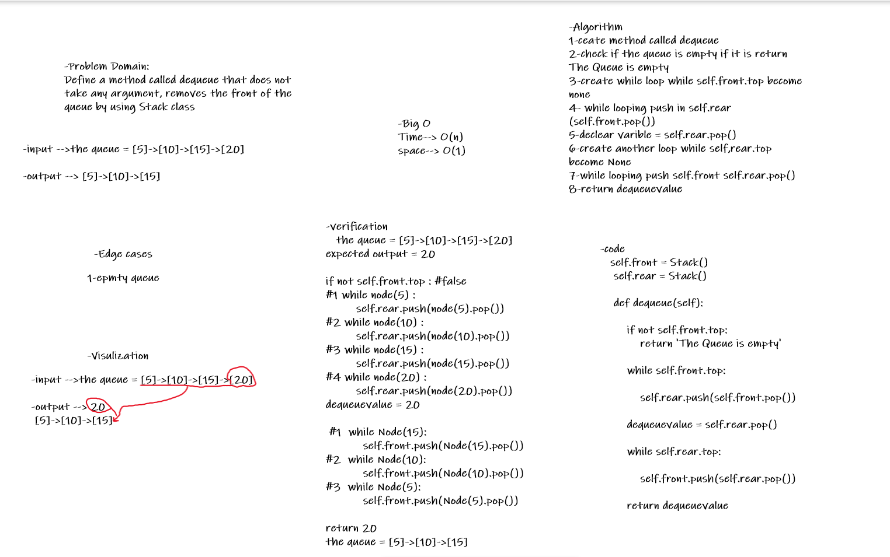

# Challenge Summary
Create a brand new PseudoQueue class. Do not use an existing Queue. Instead, this PseudoQueue class will implement our standard queue interface.

enqueue() which inserts value into the PseudoQueue, using a first-in, first-out approach.

dequeue() which extracts a value from the PseudoQueue, using a first-in, first-out approach.

## Whiteboard Process

### enqueue

### dequeue

## Approach & Efficiency

### enqueue

Ceate method called enqueue, check if the value is empty if it is return
please put a value, if not use stack class method push to push
the value to self.front

Big O :
* time : O(1)
* space : O(1)

### dequeue

Ceate method called dequeue, check if the queue is empty if it is return The Queue is empty, create while loop while self.front.top become none, while looping push in self.rear (self.front.pop()), declear varible = self.rear.pop(), create another loop while self,rear.top become None , while looping push self.front self.rear.pop(), return dequeuevalue

Big O :
* time : O(n)
* space : O(1)

