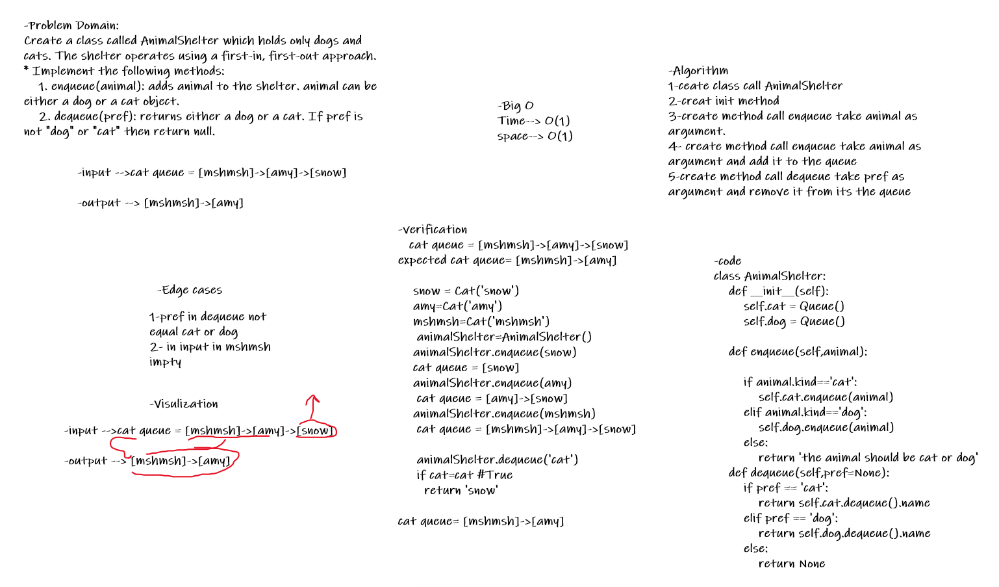

# Challenge Summary
Create a class called AnimalShelter which holds only dogs and cats. The shelter operates using a first-in, first-out approach.

* Implement the following methods:
    1. enqueue(animal): adds animal to the shelter. animal can be either a dog or a cat object.
    2. dequeue(pref): returns either a dog or a cat. If pref is not "dog" or "cat" then return null.

## Whiteboard Process

## Approach & Efficiency
### enqueue

enqueue(animal): adds animal to the shelter. animal can be either a dog or a cat object.

Big O :
* time : O(1)
* space : O(1)

### dequeue

dequeue(pref): returns either a dog or a cat. If pref is not "dog" or "cat" then return null.

Big O :
* time : O(n)
* space : O(1)
